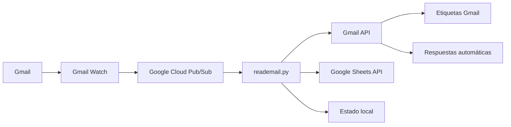

# Manual Técnico – Sistema de Facturación BTL

## 1. Resumen técnico

Este repositorio contiene un sistema en Python para automatizar la recepción y validación inicial de correos de facturación BTL usando Gmail, Google Sheets y Google Cloud Pub/Sub.

Archivo principal:

```text
reademail.py
```

El sistema opera como un listener que:

1. Autentica una o varias cuentas Gmail vía OAuth.
2. Activa `Gmail Watch` sobre las etiquetas configuradas.
3. Recibe eventos por Google Cloud Pub/Sub.
4. Consulta el historial de Gmail para identificar mensajes nuevos.
5. Descarga y analiza adjuntos.
6. Valida reglas documentales.
7. Aplica etiquetas de estado en Gmail.
8. Envía respuestas automáticas en el mismo hilo.
9. Guarda estado local para evitar reprocesos.

## 2. Arquitectura lógica

El flujo funcional del sistema puede entenderse en cinco capas:

1. **Entrada:** correos recibidos en Gmail.
2. **Activación:** Gmail Watch publica eventos en Pub/Sub.
3. **Procesamiento:** `reademail.py` interpreta el evento, consulta Gmail y analiza documentos.
4. **Validación:** reglas de negocio para factura electrónica, cuenta de cobro, nota crédito y casos administrativos.
5. **Salida:** etiquetas en Gmail, respuesta automática y registro en estado local.



## 3. Componentes principales

| Componente | Responsabilidad |
|---|---|
| Gmail API | Leer mensajes, descargar adjuntos, modificar etiquetas y enviar respuestas. |
| Google Sheets API | Cargar catálogo/lista blanca de clientes y NIT. |
| Google Pub/Sub | Recibir eventos de nuevos correos desde Gmail Watch. |
| OAuth | Autorizar cuentas Gmail y guardar `token.json`. |
| Estado local | Guardar `last_history_id`, mensajes procesados, respuestas enviadas y radicados. |
| Motor documental | Clasificar PDF, XML, imágenes, ZIP y tipos documentales. |

## 4. Permisos OAuth requeridos

El sistema solicita estos scopes:

| Scope | Uso |
|---|---|
| `https://www.googleapis.com/auth/gmail.modify` | Modificar etiquetas y estado de mensajes. |
| `https://www.googleapis.com/auth/gmail.readonly` | Leer mensajes y adjuntos. |
| `https://www.googleapis.com/auth/gmail.send` | Enviar respuestas automáticas. |
| `https://www.googleapis.com/auth/spreadsheets` | Leer catálogos y auto-completar NIT faltantes en Google Sheets. |

> El cambio al scope de escritura exige volver a autorizar todas las cuentas OAuth existentes.

## 5. Variables de entorno

El sistema carga variables desde `.env` usando `python-dotenv`.

### 5.1. Google Cloud y Pub/Sub

| Variable | Obligatoria | Descripción |
|---|---|---|
| `GCP_PROJECT_ID` | Sí | ID del proyecto en Google Cloud. |
| `PUBSUB_SUBSCRIPTION` o `PUBSUB_SUBSCRIPTION_ID` | Sí | Suscripción Pub/Sub que recibe eventos de Gmail Watch. |
| `PUBSUB_TOPIC_FULL` | Sí | Nombre completo del topic Pub/Sub. Ejemplo: `projects/PROJECT_ID/topics/TOPIC_NAME`. |
| `PUBSUB_PULL_MAX` | No | Máximo de mensajes a traer por consulta. Por defecto: `10`. |
| `PUBSUB_ACK_DEADLINE_SECONDS` | No | Tiempo de ack extendido para procesamiento. Por defecto: `600`. |
| `IDLE_SLEEP_SEC` | No | Pausa cuando no hay eventos. Por defecto: `1.0`. |
| `WATCH_RENEW_WINDOW_MS` | No | Ventana para renovar Gmail Watch antes de expirar. |

### 5.2. Gmail

| Variable | Obligatoria | Descripción |
|---|---|---|
| `GMAIL_LABEL_IDS` | No | Etiquetas Gmail monitoreadas por Watch. Por defecto: `INBOX`. |
| `GMAIL_ACCOUNTS` | No | Lista de cuentas Gmail para modo multi-cuenta, separadas por coma. |
| `ACCOUNTS_DIR` | No | Directorio donde se guardan tokens y estados por cuenta. Por defecto: `accounts`. |
| `ONLY_WITH_ATTACHMENTS` | No | Si está activo, ignora correos sin adjuntos. Por defecto: `true`. |

### 5.3. Google Sheets

| Variable | Obligatoria | Descripción |
|---|---|---|
| `CLIENT_SHEET_ID` | Recomendado | ID del Google Sheet usado como catálogo/lista blanca. |
| `CLIENT_SHEET_RANGE` | No | Rango principal. Por defecto: `Clientes!A:Z`. |
| `CLIENT_LOOKUP_RANGE` | No | Rango alterno para búsqueda de clientes. Por defecto: `Clientes!A:Z`. |
| `ACTIVE_VALUES` | No | Valores considerados activos. Por defecto: `activo,active,si,yes,1,true`. |

### 5.4. Etiquetas Gmail

| Variable | Valor por defecto |
|---|---|
| `LABEL_ADMIN_NAME` | `ADMINISTRATIVA` |
| `LABEL_REVIEW_NAME` | `REVISIÓN MANUAL` |
| `LABEL_NOTE_CREDIT_NAME` | `NOTA DE CRÉDITO` |
| `LABEL_APPROVED_NAME` | `APROBADOS` |
| `LABEL_REJECTED_NAME` | `RECHAZADOS` |

### 5.5. Archivo y movimiento de correos

| Variable | Descripción | Valor por defecto |
|---|---|---|
| `ARCHIVE_APPROVED` | Quita de Inbox los aprobados. | Hereda de `ARCHIVE_ON_STATUS`, por defecto `true`. |
| `ARCHIVE_REJECTED` | Quita de Inbox los rechazados. | Hereda de `ARCHIVE_ON_STATUS`, por defecto `true`. |
| `ARCHIVE_ADMIN` | Quita de Inbox los administrativos. | `true` |
| `ARCHIVE_NOTE_CREDIT` | Quita de Inbox las notas crédito. | `true` |
| `ARCHIVE_REVIEW` | Quita de Inbox los casos de revisión manual. | `false` |

### 5.6. Radicado y estado

| Variable | Descripción | Valor por defecto |
|---|---|---|
| `RADICADO_PREFIX` | Prefijo del ID interno. | `RAD` |
| `RADICADO_PAD` | Cantidad de dígitos del consecutivo. | `6` |
| `RADICADO_RESET_DAILY` | Reinicia consecutivo cada día. | `true` |
| `RADICADO_MAP_LIMIT` | Máximo de mapeos mensaje-radicado. | `10000` |
| `PROCESSED_CACHE_LIMIT` | Máximo de mensajes procesados guardados. | `3000` |
| `GMAIL_WATCH_STATE_FILE` | Archivo de estado para cuenta única. | `gmail_watch_state.json` |

### 5.7. Validación documental

| Variable | Descripción | Valor por defecto |
|---|---|---|
| `MIN_PDF_FACTURA_ELECTRONICA` | PDF mínimos para factura electrónica. | `3` |
| `MIN_XML_FACTURA_ELECTRONICA` | XML mínimos para factura electrónica. | `1` |
| `MIN_PDF_CUENTA_COBRO` o `REQUIRED_PDF_COUNT` | PDF mínimos para cuenta de cobro. | `4` |
| `OK_COMPRAS_PATTERNS` | Patrones para detectar OK de compras. | Lista interna separada por comas. |

### 5.8. Seguridad ZIP

| Variable | Descripción | Valor por defecto |
|---|---|---|
| `MAX_ZIP_BYTES` | Tamaño máximo del ZIP. | `25 MB` |
| `MAX_ZIP_FILES` | Máximo de archivos dentro del ZIP. | `250` |
| `MAX_ZIP_TOTAL_UNCOMPRESSED` | Tamaño máximo total descomprimido. | `150 MB` |
| `MAX_ZIP_SINGLE_FILE` | Tamaño máximo por archivo interno. | `25 MB` |
| `MAX_ZIP_NESTING` | Nivel máximo de ZIP anidado. | `2` |

## 6. Estructura esperada de archivos sensibles

### 6.1. Modo cuenta única

```text
readmail.com/
├── reademail.py
├── .env
├── credentials.json
├── token.json
└── gmail_watch_state.json
```

### 6.2. Modo multi-cuenta

```text
readmail.com/
├── reademail.py
├── .env
├── credentials.json
├── accounts/
│   ├── cuenta1@dominio.com/
│   │   ├── token.json
│   │   └── gmail_watch_state.json
│   └── cuenta2@dominio.com/
│       ├── token.json
│       └── gmail_watch_state.json
```

`credentials.json` puede estar en la raíz y ser compartido. Cada cuenta debe tener su propio `token.json`.

## 7. Instalación base

### 7.1. Crear entorno virtual

```bash
python3 -m venv .venv
source .venv/bin/activate
```

### 7.2. Instalar dependencias

Si existe `requirements.txt`, usar:

```bash
pip install -r requirements.txt
```

Si no existe, instalar las dependencias principales:

```bash
pip install python-dotenv google-api-python-client google-auth google-auth-oauthlib google-cloud-pubsub pypdf
```

## 8. Autorización OAuth

### 8.1. Autorizar una cuenta en modo multi-cuenta

```bash
python reademail.py --authorize-account correo@dominio.com
```

El sistema abre el flujo OAuth, guarda el token en:

```text
accounts/correo@dominio.com/token.json
```

Después se debe agregar la cuenta en `.env`:

```env
GMAIL_ACCOUNTS=correo@dominio.com
ACCOUNTS_DIR=accounts
```

### 8.2. Cuenta única

Si `GMAIL_ACCOUNTS` está vacío, el sistema usa el modo cuenta única y espera `token.json` en la raíz del proyecto.

## 9. Ejecución

```bash
source .venv/bin/activate
python reademail.py
```

Al iniciar, el sistema:

1. Valida variables obligatorias.
2. Carga credenciales OAuth.
3. Crea servicios Gmail y Sheets.
4. Carga catálogo de clientes.
5. Crea/verifica etiquetas Gmail.
6. Activa o renueva Gmail Watch.
7. Entra al loop de Pub/Sub.

## 10. Ejecución como servicio systemd

Archivo sugerido:

```ini
[Unit]
Description=Sistema de facturacion BTL Gmail
After=network.target

[Service]
WorkingDirectory=/opt/readmail.com
ExecStart=/opt/readmail.com/.venv/bin/python /opt/readmail.com/reademail.py
Restart=on-failure
RestartSec=10
User=ubuntu
Environment=PYTHONUNBUFFERED=1

[Install]
WantedBy=multi-user.target
```

Comandos útiles:

```bash
sudo systemctl daemon-reload
sudo systemctl enable --now readmail.service
sudo systemctl status readmail.service
journalctl -u readmail.service -f
```

Para detener:

```bash
sudo systemctl stop readmail.service
```

Para deshabilitar arranque automático:

```bash
sudo systemctl disable readmail.service
```

## 11. Flujo interno de procesamiento

### 11.1. Entrada del evento

Pub/Sub entrega un payload con:

- `historyId`
- `emailAddress`

El sistema usa `emailAddress` para seleccionar la cuenta configurada y `historyId` para consultar cambios desde el último historial conocido.

### 11.2. Consulta de mensajes nuevos

El sistema usa `users.history.list` con `historyTypes=["messageAdded"]` para recuperar IDs de mensajes agregados desde el último `last_history_id` guardado.

### 11.3. Control de reprocesamiento

El estado local guarda:

- `processed_message_ids`
- `replied_message_ids`
- `message_radicados`
- `last_history_id`
- `watch_expiration_ms`
- `radicado_counter`
- `radicado_date`

Esto evita responder dos veces el mismo correo y mantiene trazabilidad del radicado.

## 12. Reglas de negocio

### 12.1. Ruta administrativa

Antes de validar la factura, el sistema busca NIT o nombre en asunto, cuerpo y snippet. Si coincide con un registro activo del catálogo, aplica etiqueta `ADMINISTRATIVA` y termina el procesamiento.

### 12.2. Nota crédito

El sistema detecta nota crédito en:

- Asunto/cuerpo/snippet del correo.
- Nombre de PDF.
- Texto extraído del PDF.

Si detecta la señal, etiqueta `NOTA DE CRÉDITO` y termina.

### 12.3. Revisión manual

Si después de unificar adjuntos no existe al menos un PDF, aplica `REVISIÓN MANUAL`.

### 12.4. Clasificación de tipo de factura

```text
Si hay al menos 1 XML -> FACTURA ELECTRÓNICA
Si no hay XML -> CUENTA DE COBRO
```

### 12.5. Factura electrónica

Valida:

- Cantidad mínima de PDF.
- Cantidad mínima de XML.
- Presencia de orden de compra.
- Identificación de cliente contra catálogo.
- Presencia de OK de compras dentro de los PDF.

Si falla una o más reglas, aplica `RECHAZADOS` y responde al remitente.

Si cumple, aplica `APROBADOS` y responde al remitente.

### 12.6. Cuenta de cobro

Valida clasificación documental de:

- Cuenta de cobro.
- Cédula.
- RUT.
- Certificado bancario.
- Orden de compra.

La clasificación se basa en nombre de archivo y texto extraído del documento. Las imágenes pueden apoyar algunos tipos documentales, según configuración interna.

## 13. Extracción documental

### 13.1. Adjuntos directos

El sistema conserva únicamente:

- PDF.
- XML.
- JPG/JPEG.
- PNG.

### 13.2. ZIP

Para ZIP, el sistema:

1. Valida tamaño del ZIP.
2. Valida cantidad de archivos.
3. Bloquea ZIP con contraseña.
4. Bloquea rutas inseguras como `../`.
5. Bloquea exceso de tamaño descomprimido.
6. Permite ZIP anidado hasta el nivel configurado.
7. Extrae PDF, XML e imágenes.

### 13.3. PDF

El texto del PDF se extrae con `pypdf` o `PyPDF2` como fallback.

Limitación crítica: no hay OCR. Si el PDF es escaneado como imagen, no se podrá leer su contenido textual.

## 14. Catálogo de clientes

El catálogo se lee desde Google Sheets.

Columnas reconocidas:

| Campo lógico | Alias aceptados |
|---|---|
| Cliente | `cliente`, `razon social`, `razón social`, `nombre cliente`, `client`, `empresa`, `proveedor`, `proverdor` |
| NIT | `nit`, `nit cliente`, `tax id` |
| Estado | `estado`, `activo`, `status` |

Si no se detectan encabezados, el sistema asume:

1. Columna A: cliente.
2. Columna B: NIT.
3. Columna C: estado.

Solo se consideran activos los registros cuyo estado coincida con `ACTIVE_VALUES`. Si no hay estado, el registro se considera activo.

## 15. Respuestas automáticas

### 15.1. Rechazo

Asunto interno generado:

```text
RECHAZADO - facturacion no radicada (ID: RAD-AAAAMMDD-000001)
```

El correo se responde en el mismo hilo original usando headers `In-Reply-To`, `References` y `threadId`.

### 15.2. Aprobación

Asunto interno generado:

```text
APROBADO - facturacion recibida correctamente (ID: RAD-AAAAMMDD-000001)
```

La respuesta incluye:

- ID interno.
- Cliente.
- Clasificación.
- Cantidad de PDF.
- Cantidad de XML.

## 16. Logs principales

El sistema imprime logs operativos en consola o `journalctl`.

Ejemplos de señales:

| Log | Significado |
|---|---|
| `Watch activo` | Gmail Watch fue creado o renovado. |
| `Catálogo/lista blanca cargado` | Google Sheet se leyó correctamente. |
| `ZIP leído` | ZIP procesado correctamente. |
| `ADMINISTRATIVA` | Correo clasificado como administrativo. |
| `NOTA DE CREDITO` | Correo clasificado como nota crédito. |
| `REVISION MANUAL` | No se pudo validar automáticamente. |
| `RECHAZADO` | Falló una o varias reglas. |
| `APROBADO` | Cumplió reglas mínimas. |
| `HistoryId viejo/inválido` | Gmail ya no permite consultar desde ese historial; el sistema resetea punto de partida. |

## 17. Troubleshooting

### 17.1. Error: faltan variables de entorno

Validar `.env`:

```bash
cat .env
```

Deben existir como mínimo:

```env
GCP_PROJECT_ID=
PUBSUB_SUBSCRIPTION=
PUBSUB_TOPIC_FULL=
```

### 17.2. No llegan eventos

Revisar:

1. Que Gmail Watch esté activo.
2. Que el topic tenga permisos para recibir eventos de Gmail.
3. Que la suscripción exista.
4. Que `PUBSUB_TOPIC_FULL` y `PUBSUB_SUBSCRIPTION` apunten al mismo proyecto.
5. Logs del servicio.

### 17.3. No procesa una cuenta en modo multi-cuenta

Revisar:

1. Que el email esté en `GMAIL_ACCOUNTS`.
2. Que exista `accounts/email/token.json`.
3. Que el token corresponda realmente a esa cuenta.
4. Que el evento Pub/Sub venga con el mismo `emailAddress`.

### 17.4. Rechaza documentos correctos

Causas frecuentes:

- PDF escaneado sin texto digital.
- Nombre de archivo poco claro.
- Cliente no existe en Google Sheets.
- Orden de compra no contiene palabras detectables.
- OK de compras está en una imagen o escaneo.
- XML no fue adjuntado.
- ZIP protegido o corrupto.

### 17.5. Responde dos veces

Revisar archivo de estado:

```text
gmail_watch_state.json
```

o, en multi-cuenta:

```text
accounts/correo@dominio.com/gmail_watch_state.json
```

El sistema usa `replied_message_ids` para evitar duplicar respuestas. Si se borra el estado, puede reprocesar.

## 18. Seguridad y mantenimiento

### 18.1. Archivos sensibles

No subir al repositorio:

- `.env`
- `credentials.json`
- `token.json`
- `gmail_watch_state.json`
- Carpeta `accounts/`

### 18.2. Permisos recomendados en servidor

```bash
chmod 600 .env credentials.json
chmod 700 accounts
find accounts -name "token.json" -exec chmod 600 {} \;
```

### 18.3. Backups recomendados

Respaldar periódicamente:

- `.env`
- `credentials.json`
- `accounts/`
- Archivos `gmail_watch_state.json`

## 19. Mejoras recomendadas

1. Crear `requirements.txt` con dependencias exactas.
2. Crear `.env.example` sin secretos.
3. Externalizar reglas documentales a JSON o YAML.
4. Guardar resultados en Google Sheets o base de datos para auditoría.
5. Agregar logs estructurados en JSON.
6. Agregar modo dry-run para pruebas sin enviar respuestas.
7. Agregar OCR opcional para PDF escaneados.
8. Agregar pruebas unitarias para clasificadores documentales.
9. Diferenciar mensajes de rechazo por motivo específico configurable.
10. Crear dashboard de volúmenes: recibidos, aprobados, rechazados, revisión manual, notas crédito.

## 20. Comandos rápidos

```bash
# Activar entorno
source .venv/bin/activate

# Autorizar cuenta
python reademail.py --authorize-account correo@dominio.com

# Ejecutar manualmente
python reademail.py

# Ver servicio
sudo systemctl status readmail.service

# Ver logs
journalctl -u readmail.service -f

# Detener servicio
sudo systemctl stop readmail.service

# Encender servicio
sudo systemctl enable --now readmail.service
```
