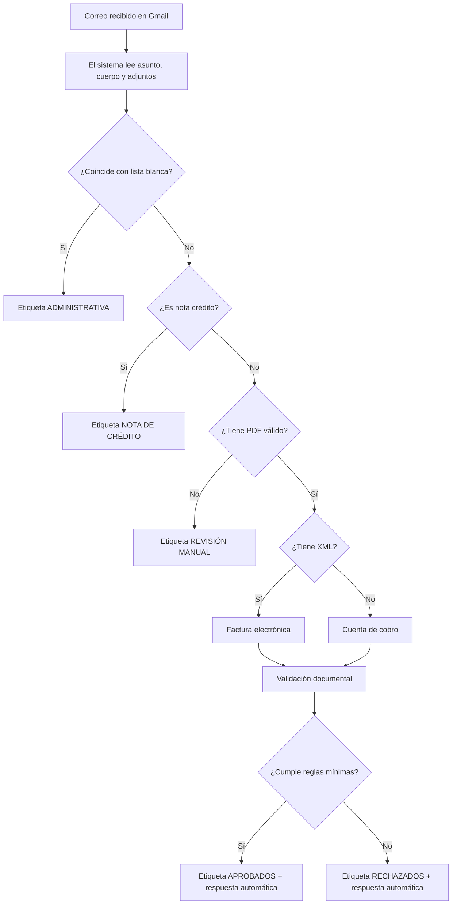

# Manual de Usuario – Sistema de Facturación 

## 1. Propósito del sistema

El Sistema de Facturación BTL automatiza la recepción, validación básica y clasificación de correos de facturación que llegan a una o varias cuentas Gmail configuradas.

Su objetivo es ayudar al equipo administrativo a separar rápidamente los correos que pueden avanzar en el proceso de radicación de aquellos que requieren revisión, corrección o tratamiento especial.

El sistema:

- Lee correos nuevos recibidos en Gmail.
- Revisa asunto, cuerpo del correo y adjuntos.
- Descarga documentos PDF, XML, imágenes y ZIP.
- Abre archivos ZIP y ZIP anidados, bajo límites de seguridad.
- Clasifica el correo como factura electrónica, cuenta de cobro, nota crédito, administrativa, aprobado, rechazado o revisión manual.
- Aplica etiquetas en Gmail.
- Responde automáticamente al remitente cuando la radicación es aprobada o rechazada.

## 2. Alcance funcional

El sistema está diseñado para apoyar el proceso de recepción documental. No reemplaza la revisión contable, tributaria ni legal posterior.

Automatiza una primera capa de control:

1. Verifica que el correo tenga documentos adjuntos.
2. Identifica si hay PDF, XML o imágenes.
3. Determina si el envío corresponde a una factura electrónica o a una cuenta de cobro.
4. Revisa documentos mínimos.
5. Busca señales de orden de compra.
6. Busca el cliente contra un catálogo en Google Sheets.
7. Busca evidencia de OK de compras.
8. Detecta notas crédito.
9. Etiqueta el correo según el resultado.
10. Envía una respuesta automática al remitente cuando aplica.

## 3. Etiquetas que usa el sistema

El sistema crea o verifica automáticamente las etiquetas necesarias en Gmail.

| Etiqueta | Significado | Acción esperada |
|---|---|---|
| ADMINISTRATIVA | El correo coincide con un NIT o nombre incluido en la lista blanca del catálogo. | Revisar como caso administrativo, no como radicación estándar. |
| REVISIÓN MANUAL | El sistema no encontró al menos un PDF válido o no puede validar automáticamente el caso. | Revisar manualmente el correo y sus adjuntos. |
| NOTA DE CRÉDITO | El sistema detectó una nota crédito en el asunto, cuerpo, nombre del PDF o texto interno del PDF. | Gestionar bajo el flujo correspondiente de notas crédito. |
| APROBADOS | El correo cumple las reglas mínimas de validación. | Continuar con el proceso interno de radicación. |
| RECHAZADOS | El correo no cumple una o varias reglas mínimas. | El remitente recibe respuesta automática indicando que no fue posible radicar. |

Los nombres de las etiquetas pueden cambiarse desde las variables de entorno del sistema.

## 4. Flujo general para el usuario



## 5. ¿Qué debe enviar el proveedor o remitente?

### 5.1. Para factura electrónica

El envío debe incluir, como mínimo:

- PDF de la factura.
- XML de la factura electrónica.
- Orden de compra o documento donde se pueda detectar la orden.
- Soporte de aprobación u OK de compras dentro de los PDF.
- Información que permita identificar al cliente.

La cantidad mínima de PDF y XML se configura técnicamente. En la versión actual, el sistema toma como referencia mínima configurada para factura electrónica:

- PDF mínimos: `MIN_PDF_FACTURA_ELECTRONICA`
- XML mínimos: `MIN_XML_FACTURA_ELECTRONICA`

Si no se configuran estos valores, el sistema usa sus valores por defecto.

### 5.2. Para cuenta de cobro

El envío debe contener los documentos obligatorios definidos por el sistema:

| Documento | Qué valida el sistema |
|---|---|
| Cuenta de cobro | Palabras o señales como “cuenta de cobro”, “debe a”, “la suma de”, entre otras. |
| Cédula | Señales de documento de identidad o identificación personal. |
| RUT | Señales de RUT, DIAN, NIT, actividad económica, formulario de registro, entre otras. |
| Certificado bancario | Señales como certificado bancario, cuenta de ahorros, banco, número de producto, etc. |
| Orden de compra | Señales como orden de compra, orden número, autorizado por, subtotal, Century Media, entre otras. |

Si falta alguno, el correo se marca como rechazado o incompleto según la validación.

## 6. ¿Qué pasa si el proveedor envía ZIP?

El sistema puede leer archivos ZIP. También puede leer ZIP dentro de ZIP, con límites de seguridad.

Al procesar un ZIP, el sistema:

- Revisa que no esté corrupto.
- Revisa que no esté protegido con contraseña.
- Revisa que no tenga rutas inseguras.
- Revisa que no exceda el tamaño permitido.
- Extrae PDF, XML e imágenes válidas.
- Ignora archivos internos no relevantes como carpetas de sistema de macOS.

Si el ZIP tiene errores, el caso puede rechazarse o pasar a revisión según el punto del flujo en el que falle.

## 7. ¿Qué respuestas automáticas envía?

### 7.1. Aprobado

Cuando el envío cumple las reglas mínimas, el remitente recibe una respuesta en el mismo hilo indicando:

- ID interno de radicación.
- Cliente identificado.
- Clasificación detectada.
- Cantidad de PDF detectados.
- Cantidad de XML detectados.
- Confirmación de que la radicación queda en proceso interno.

### 7.2. Rechazado

Cuando el envío no cumple las reglas mínimas, el remitente recibe una respuesta en el mismo hilo indicando:

- ID interno.
- Cliente identificado, si se logró detectar.
- Clasificación detectada.
- Mensaje de que no fue posible radicar por documentación incompleta.

Actualmente el mensaje hacia el proveedor es general y evita exponer demasiada lógica interna. Los motivos específicos se imprimen en logs para revisión técnica.

## 8. ID interno de radicación

Cada correo procesado recibe un ID interno o radicado.

El formato por defecto es:

```text
RAD-AAAAMMDD-000001
```

Ejemplo:

```text
RAD-20260612-000001
```

El consecutivo puede reiniciarse diariamente, según configuración técnica.

## 9. Casos especiales

### 9.1. Correos administrativos

Si el sistema detecta un NIT o nombre de cliente incluido en la lista blanca del Google Sheet, clasifica el correo como `ADMINISTRATIVA`.

Esto evita que ciertos correos entren al flujo estándar de facturación cuando ya están identificados como administrativos.

### 9.2. Notas crédito

El sistema revisa señales de nota crédito en:

- Asunto del correo.
- Cuerpo del correo.
- Nombre del PDF.
- Texto extraído del PDF.

Si encuentra la señal, etiqueta el correo como `NOTA DE CRÉDITO`.

### 9.3. PDF escaneado

El sistema no usa OCR. Esto significa que si un PDF está escaneado como imagen y no tiene texto seleccionable, el sistema puede no detectar cliente, orden de compra, OK de compras o palabras clave.

En ese caso, el correo puede ser rechazado o enviado a revisión manual aunque visualmente el documento parezca correcto.

## 10. Recomendaciones operativas para el equipo

Para reducir rechazos innecesarios:

1. Pedir a proveedores que envíen PDF con texto digital, no solo escaneos.
2. Solicitar que los archivos tengan nombres claros: factura, XML, orden de compra, RUT, certificado bancario, etc.
3. Evitar ZIP con contraseña.
4. Evitar enviar documentos repartidos en varios correos.
5. Mantener actualizado el catálogo de clientes en Google Sheets.
6. Revisar diariamente las etiquetas `RECHAZADOS` y `REVISIÓN MANUAL`.
7. Validar que las respuestas automáticas estén saliendo correctamente.

## 11. Qué revisar en Gmail cada día

| Etiqueta | Prioridad de revisión | Qué hacer |
|---|---:|---|
| REVISIÓN MANUAL | Alta | Validar adjuntos, PDF escaneados o casos fuera de regla. |
| RECHAZADOS | Media/Alta | Revisar si el rechazo fue correcto o si se requiere excepción. |
| APROBADOS | Media | Continuar proceso interno. |
| NOTA DE CRÉDITO | Media | Gestionar por flujo financiero correspondiente. |
| ADMINISTRATIVA | Baja/Media | Revisar si corresponde a comunicación no radicable. |

## 12. Limitaciones conocidas

- No interpreta documentos escaneados sin texto digital.
- No valida legalmente la factura.
- No confirma valores, impuestos o retenciones.
- No valida contra sistemas contables externos.
- No descarga archivos desde enlaces externos; trabaja con adjuntos.
- No procesa correos sin adjuntos cuando `ONLY_WITH_ATTACHMENTS` está activo.
- La detección depende de palabras clave, estructura del documento y calidad del texto extraído.

## 13. Buenas prácticas para proveedores

Mensaje sugerido para proveedores:

> Para una correcta radicación, por favor envía la documentación completa en un solo correo, con PDF legibles y texto seleccionable. Si es factura electrónica, adjunta también el XML. Evita archivos ZIP con contraseña y usa nombres claros para cada documento: factura, orden de compra, RUT, certificado bancario, cuenta de cobro, etc.
